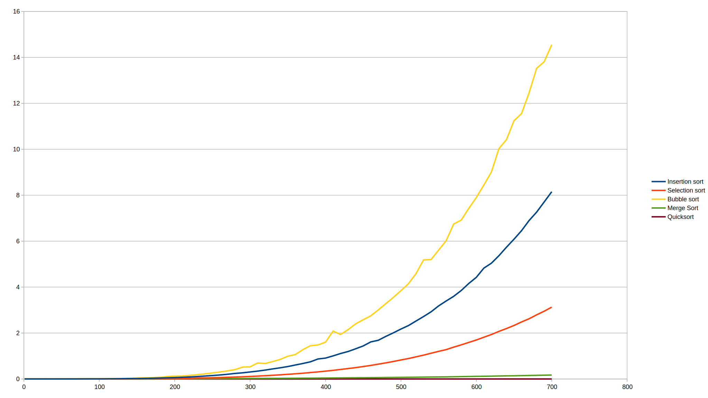

# Sort me out
# Opis projektu
Projekt groupowy sortmeout to projekt mający na celu poznanie oraz popularyzacje algorytmów sortowania oraz naukę pracy zespołowej podczas programowania.

Projekt składa się z następujących funkcjonalności
* generowanie ciągów o podanej przez użytkownika długości
* zapisywanie ciągów do pliku
* odczytywanie ciągów z pliku
* sortowanie ciągów za pomocą selection sort
* sortowanie ciągów za pomocą insertion sort
* sortowanie ciągów za pomocą bubble sort
* sortowanie ciągów za pomocą merge sort
* sortowanie ciągów za pomocą quick sort
* pomiary czasu sortowań

# Algorytmy sortowań
## Selection sort (sortowanie przez wybieranie)


Algorytm selection sort wyszukuje najmniejszy element z całej tablicy i wstawia go jako ostatni element tablicy posortowanej.

## Pseudokod
```c++
function selectionSort(array a)
  for i in 0 -> a.length - 2 do
    maxIndex = i
		  for j in (i + 1) -> (a.length - 1) do
  		  if a[j] > a[maxIndex]
      		maxIndex = j
  		swap(a[i], a[maxIndex])
```

## Złożoność
| Sytuacja | Złożoność |
| --- | --- |
| pesymistyczna | O(n^2) |
| typowa | O(n^2) |
| optymistyczna | O(n^2) |

## Przykład
| iteracja | tablica | minimum |
| ---: | :---: | :---: |
| 0 | [/**15, 14, 3, >>1<<, 2, 5, 11, 4**] | 1 |
| 1 | [1, /**15, 14, 3, >>2<<, 5, 11, 4**] | 2 |
| 2 | [1, 2, /**15, 14, >>3<<, 5, 11, 4**] | 3 |
| 3 | [1, 2, 3, /**15, 14, 5, 11, >>4<<**] | 4 |
| 4 | [1, 2, 3, 4, /**15, 14, >>5<<, 11**] | 5 |
| 5 | [1, 2, 3, 4, 5, /**15, 14, >>11<<**] | 11 |
| 6 | [1, 2, 3, 4, 5, 11, /**15, >>14<<**] | 14 |
| 7 | [1, 2, 3, 4, 5, 11, 14, /**>>15<<**] | 15 |
| 8 | [1, 2, 3, 4, 5, 11, 14, 15] | ciąg jest posortowany |
* _**porgrubione** - nieposortowana tablica_
* _/ - granica nieposortowanej tablicy_
* _>>5<< - minimalna wartość_

---

## Insertion sort (sortowanie przez wstawianie)


Algorytm insertion sort bierze dowolny (nie ma znaczenia który) element z tablicy nieposortowanej i wstawia w odpowiednie miejsce w tablicy posortowanej.


## Pseudokod
```c++
function  insertionSort(A, n) // A[0..n-1]
  for i=1 to n:
    klucz = A[i]
    // Wstaw A[i] w posortowany ciąg A[1 ... i-1]
    j = i - 1
    while j>=0 and A[j]>klucz:
      A[j + 1] = A[j]
      A[j] = klucz
      j--
```

## Złożoność
| Sytuacja | Złożoność |
| --- | --- |
| pesymistyczna | O(n^2) |
| typowa | O(n^2) |
| optymistyczna | O(n) |

## Przykład
| iteracja | tablica |
| ---: | :---: |
| 0 | [3, **15, 14, 1, 2, 5, 11, 4**] |
| 1 | [3, 15, **14, 1, 2, 5, 11, 4**] |
| 2 | [3, 14, 15, **1, 2, 5, 11, 4**] |
| 3 | [1, 3, 14, 15, **2, 5, 11, 4**] |
| 4 | [1, 2, 3, 14, 15, **5, 11, 4**] |
| 5 | [1, 2, 3, 5, 14, 15, **11, 4**] |
| 6 | [1, 2, 3, 5, 11, 14, 15, **4**] |
| 7 | [1, 2, 3, 4, 5, 11, 14, 15] |
* _**porgrubione** - nieposortowana tablica_

---

## Bubble sort (sortowanie bąbelkowe)


Algorytm bubble sort porównuje dwa kolejne sąsiadujące elementy i w razie konieczności zamienia je aż do końca. Czynność jest powtarzana, aż do sytuacji w której w ciągu przejścia całej tablicy nie dokonano żadnej zmiany - tablica jest posortowana.


### Pseudokod
```c++
function  bubbleSort(A, n) // A[0..n-1]
  for i=0 to n:
    for j=1 to n:
      if A[j-1] > A[j]:
        swap(A[j-1], A[j])
```

### Złożoność
| Sytuacja | Złożoność |
| --- | --- |
| pesymistyczna | O(n^2) |
| typowa | O(n^2) |
| optymistyczna | O(n) |

### Przykład
| iteracja | tablica |
| ---: | :---: |
| 0 | [3, 15, 14, 1, 2, 5, 11, 4] |
| 1 | [3, 14, 1, 2, 5, 11, 4, 15] |
| 2 | [3, 1, 2, 5, 11, 4, 14, 15] |
| 3 | [1, 2, 3, 5, 4, 11, 14, 15] |
| 4 | [1, 2, 3, 4, 5, 11, 14, 15] |

## Merge sort (sortowanie przez scalanie)


Algorytm mergesort dzieli tablice na dwie równe części. Dla każdej z części stosouje algorytm sortowanie przez scalanie lub zwraca element jeśli został tylko jeden. Po wykonanych działaniach łączy tablice w całość.

Scalanie wykonuje się następująco:
* Indeksy tablicy A oraz B są ustawione na pierwsze elementy.
* Jeżeli ciąg A wyczerpany (i>n), dołącz pozostałe elementy ciągu B do C i zakończ pracę.
* Jeżeli ciąg B wyczerpany (j>m), dołącz pozostałe elementy ciągu A do C i zakończ pracę.
* Jeżeli A[i] <= B[j] dołącz A[i] do C i zwiększ i o jeden, w przeciwnym przypadku dołącz B[j] do C i zwiększ j o jeden
* Powtarzaj od kroku 2 aż wszystkie wyrazy A i B trafią do C.


### Pseudokod
```c++
function mergesort( var a as array )
  if(n ==1)
    return a
  var l1 as array = a[0] ... a[n/2]
  var l2 as array = a[n/2+1] ... a[n]

  l1 = mergesort( l1 )
  l2 = mergesort( l2 )

  return merge( l1, l2 )
```

Funkcja scalająca
```c++
function merge( var a as array, var b as array )
  var c as array

  while ( a and b have elements )
    if ( a[0] > b[0] )
      add b[0] to the end of c
      remove b[0] from b
    else
      add a[0] to the end of c
      remove a[0] from a

    while ( a has elements )
      add a[0] to the end of c
      remove a[0] from a
    while ( b has elements )
      add b[0] to the end of c
      remove b[0] from b

  return c
```

### Złożoność
| Sytuacja | Złożoność |
| --- | --- |
| pesymistyczna | O(n^2) |
| typowa | O(n^2) |
| optymistyczna | O(n) |

### Przykład


## Quicksort (sortowanie szybkie)
 do zrobienia!


# Działanie algorytmów

## Wnioski
 do zrobienia

# TODO
[TODO.md](TODO.md)
